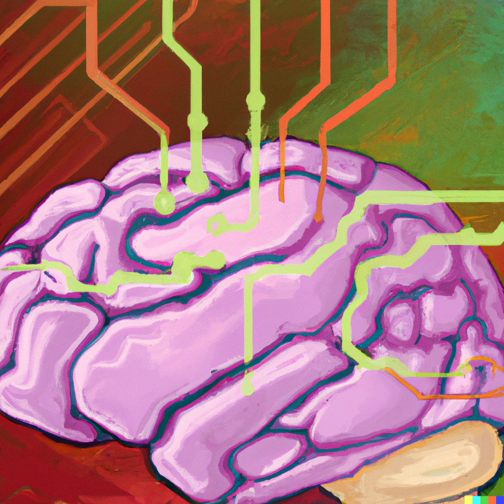

## <a style='color:darkturquoise'>
Exploring the role of (self-)attention in cognitive and computer vision architecture
</a>

<a href="https://arxiv.org/abs/2306.14650" target="_blank"><button type="button" class="btn btn-lg btn-primary">Manuscript in PDF</button></a>

The thesis defense took place on April 13th 2023. <a href="https://docs.google.com/presentation/d/18MowWN7zjDfqUiJWD3pl3NsuSrrXtc4vnrcGjX2RErg/edit?usp=sharing" target="_blank">[slides]</a> 

<kbd> Committee </kbd>

* [Jonathan D. Cohen](http://pni.princeton.edu/faculty/jonathan-cohen), *Princeton University*, USA,
* [Hugues Talbot](https://hugues-talbot.github.io), *CentraleSup\`elec*, France
* [Jessica B. Hamrick](https://hugues-talbot.github.io), *DeepMind*, UK
* [Timoth\`ee Masquelier](https://cerco.cnrs.fr/pagesp/tim/), *CerCo*, France
* [Thomas Serre](https://serre-lab.clps.brown.edu/person/thomas-serre/), *Brown University*, USA, <a style='color:lightsalmon'>Thesis Director</a>
* [Nicholas Asher](https://www.cnrs.fr/fr/personne/nicholas-asher), *ANITI*, France, <a style='color:lightsalmon'>Thesis Co-Director</a>

<kbd> Abstract </kbd>

A fundamental mechanism of cognition needed to perform complex reasoning tasks is the ability to selectively process information (attention) and retain information in an accessible state (memory). We systematically analyze the role of both these components, starting with Transformer-based self-attention as a model of attention and later extending the architecture with memory. The Transformer is the latest and seemingly most powerful class of neural architecture, and it has brought a paradigm shift in the field of artificial intelligence. It has replaced recurrence and convolution networks with self-attention as the de-facto architectural choice for most AI applications. 

We first study the computational mechanisms involved in a synthetic visual reasoning test (SVRT) challenge, analyzing the ability of popular computer vision architecture (ResNet) of different depths trained on different dataset sizes. It led to a novel, finer taxonomy for the twenty-three SVRT tasks consistent with the broadly accepted same-different (SD) and spatial-relation (SR) classes of reasoning tasks in literature. Next, we study the role of self-attention incorporated with ResNet50 in solving the SVRT challenge. Inspired by the two types of visual attention systems, we modeled self-attention to be used as feature-based and spatial attention to enrich the feature maps of a feedforward network. We evaluated the ability of these attention networks to solve the SVRT challenge and found the resulting architectures to be much more efficient at solving the hardest of these visual reasoning tasks. The novel taxonomy obtained earlier is also partially explained by the relative improvement of the two attention networks and leads to testable predictions regarding the attentional needs of SVRT tasks. 

At last, we develop a novel cognitive architecture integrating attention and memory. We propose GAMR: <strong>G</strong>uided <strong>A</strong>ttention <strong>M</strong>odel for (visual) <strong>R</strong>easoning, motivated by the theory of active vision. GAMR has similar working mechanisms as that of the brain that solves complex visual reasoning tasks via sequences of attention shifts to select and route the task-relevant visual information into memory. This shift of attention is implemented with the help of a attention module guided by an internally generated query. We demonstrate that <em>GAMR</em> is sample-efficient, robust, and compositional compared to either of the feedforward, attention or memory-based architectures. In addition, <em>GAMR</em> is shown to be capable of zero-shot generalization on completely novel reasoning tasks. Overall, our work analyzes the role of self-attention in cognitive and computer vision architecture by their ability to solve complex visual reasoning tasks needing  attention as a key component to efficiently solve reasoning tasks.

